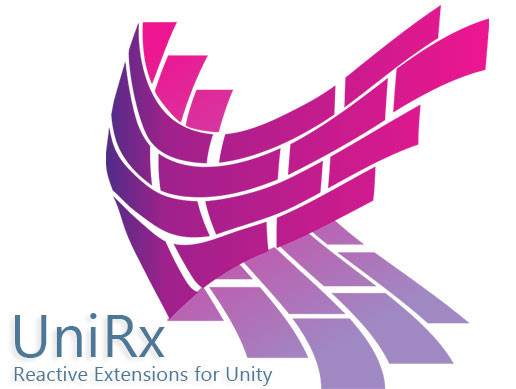

## 本リポジトリについて

UniRxを勉強したい方に向けて製作したリポジトリです。プッシュ、マージは行わないでください。

使用する場合はフォークして使用してください。

## ゲーム内のデータについて

本リポジトリにあるゲームは簡単なブロック崩しです。

すでにゲームの内容はできています。

現在あるUIのボタンをUniRxとMV(R)Pのデザインパターンを用いて実装し、勉強に役立ててください。

## UniRxの使い方

UniRxの１つの大きな機能でイベント処理が簡単にコーディングできます。

例.ReactivePropatyは値が変更されるとイベントが発行される関数です

この処理を用いることで、依存関係の逆転を起こせます。例えば、ボタンからボタンを押された際の処理を行うのではなく、ボタンの押された処理が、ボタンを押されたことを確認して自分で処理を出来るようになります。
この依存関係の逆転を行えると色々と良いことがあるのですが、それは別途調べていてください。
